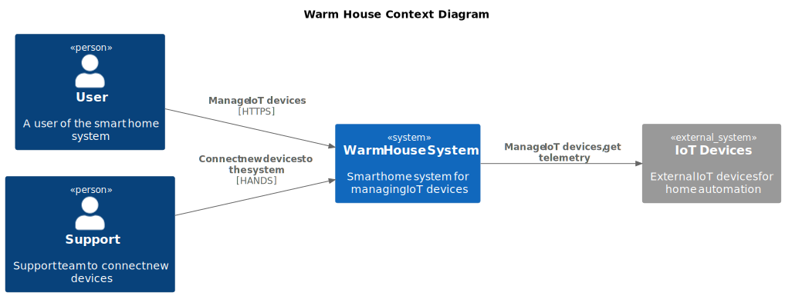
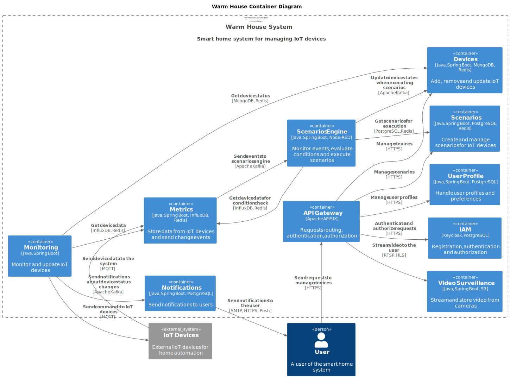
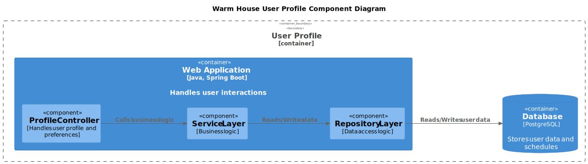
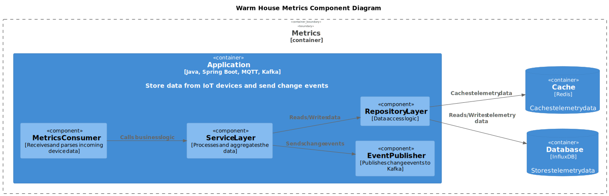
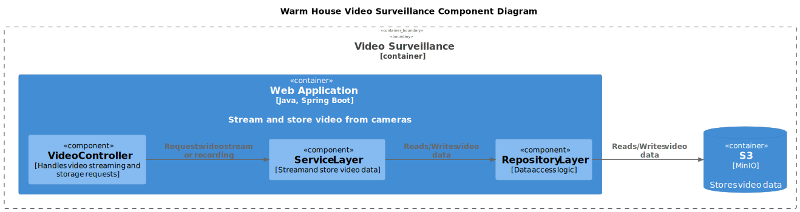
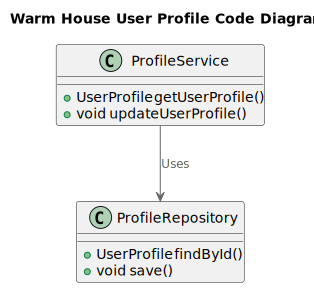
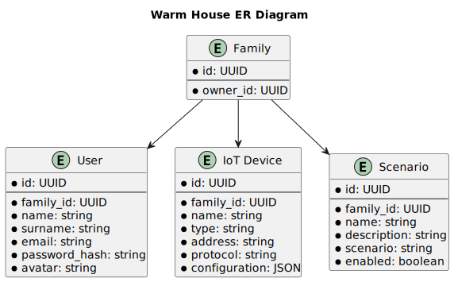

# Архитектурное описание: Тёплый дом

Компания "Тёплый дом" предоставляет систему удалённого управления отоплением и другими устройствами в жилых домах.
Недавно она выиграла тендер на разработку системы "умных" домов, что требует значительного расширения существующего
функционала.

Текущий документ описывает архитектуру существующего (As-Is) решения, планируемую (To-Be), и план перехода к
новой системе.

# Анализ и планирование

**Функциональные требования** To-Be архитектуры:

- Включать/выключать отопление
- Настраивать температуру
- Включать/выключать освещение
- Открывать/закрывать ворота
- Видеонаблюдение
- Настройки сценариев использования

Система должна быть легко расширяемой, клиент должен иметь возможность самостоятельно подключать устройства по
стандартным протоколам и настраивать сценарии использования.

**Нефункциональные требования**:

- При активном расширении, количество пользователей может доходить до нескольких сотен тысяч.
- У каждого пользователя может быть до 100 устройств и сценариев использования.
- Пользователи могут быть географически распределены по всему миру.

### 1. Описание функциональности монолитного приложения

- Пользователи могут удалённо включать/выключать отопление в своих домах, а также настраивать температуру.

- Пользователи могут просматривать текущую температуру и статус отопления в своих домах через веб-интерфейс.

### 2. Анализ архитектуры монолитного приложения

- Язык программирования: Java
- Фреймворк: Spring Boot
- База данных: PostgreSQL
- Архитектура: Монолитная, все компоненты находятся в одном приложении.
- Взаимодействие: Синхронное через REST API.
- Масштабируемость: Можно масштабировать только целиком приложение.
- Развертывание: Приложение обновляется целиком через Helm-чарт в Kubernetes.
- Разработка: Команда работает над всем приложением сразу с одним стеком технологий.

### 3. Определение доменов и границы контекстов

- As-Is архитектура:

* Управление отоплением:
  - Включение/выключение отопления.
  - Настройка, просмотр температуры.

- To-be архитектура:

В зависимости от количества возможных устройств, их типов и функционала, можно по-разному выделить домены.

Если устройств планируется много, то имеет смысл выделить следующие домены:

- Пользователи: регистрация, аутентификация, авторизация, профиль.
- Устройства: добавление, удаление, изменение.
- Мониторинг состояния: проверка устройств на соответствие целевым показателям и отправка команд.
- Метрики: получение данных от устройств и отправка событий об изменениях состояния.
- Сценарии: создание, изменение, удаление, мониторинг событий и проверка условий.
- Видеонаблюдение: получение данных от камер и отправка видеопотока пользователю.

При необходимости можно добавить домены для работы со специальными устройствами или бизнес-логикой.

Если устройств немного, или они сильно различаются по функционалу, бизнес-логике:

- Пользователи: регистрация, аутентификация, авторизация, профиль.
- Устройства: добавление, удаление, изменение.
- Отопление: включение, выключение, изменение температуры.
- Освещение: включение, выключение, изменение яркости.
- Ворота: открытие, закрытие.
- Сценарии: создание, изменение, удаление, мониторинг событий и проверка условий.
- Видеонаблюдение: получение данных от камер и отправка видеопотока пользователю.

### **4. Проблемы монолитного решения**

Приложение имеет типичные проблемы монолитной архитектуры:

- **Развертывание**: невозможно обновлять отдельные компоненты, что неэффективно использует ресурсы и увеличивает время
  обновления.
- **Масштабируемость**: невозможно масштабировать отдельные компоненты, что приводит к неэффективному использованию
  ресурсов.
- **Отказоустойчивость**: сбой одного компонента может привести к сбою всего приложения.
- **Синхронность**: невозможно обрабатывать запросы асинхронно, что увеличивает время отклика приложения.
- **Разработка**: команда работает над всем приложением, что может привести к конфликтам при слиянии кода,
  увеличению времени на разработку, ограничение в выборе технологий.
- **Тестирование**: сложно тестировать и отлаживать отдельные компоненты, увеличивает время на тестирование и риски
  ошибок.

### 5. Визуализация контекста системы — диаграмма С4

# Проектирование микросервисной архитектуры

Основной способ общения между микросервисами – брокер сообщений, например, Kafka или MQTT. При необходимости можно
добавить синхронные межсервисные вызовы на основе gRPC или GraphQL.

В качестве IAM можно использовать Keycloak в связке с API Gateway.

Для хранения данных о пользователях можно использовать реляционную БД, например, PostgreSQL. Для устройств больше
подходит нереляционная БД, так как неизвестен формат всех устройств. Для метрик с устройств можно использовать InfluxDB
с шардингом по пользователям. Также, так как у нас ожидается большое количество пользователей и устройств, можно
добавить кэширование для баз данных событий, сценариев и устройств, чтобы уменьшить нагрузку на основные БД и ускорить
запросы.

Реализацию сценариев можно сделать на основе Node-RED, Home Assistant, Drools или аналогичных систем.

Видеонаблюдение может работать на основе RTSP для трансляции в реальном времени, а прошлые записи можно
сохранять в S3-совместимое хранилище и использовать HLS для доступа к ним. Так как видеозаписи статичны, можно
кэшировать их в CDN.

По итогу микросервисы могут выглядеть следующим образом:

- Apache APISIX Gateway: маршрутизация, балансировка запросов, аутентификация и авторизация пользователей.
- Keycloak: управление пользователями, аутентификация и авторизация. БД: PostgreSQL.
- Профиль: настройки пользователя. БД: PostgreSQL.
- Устройства: добавление, удаление, изменение. БД: MongoDB. Кэш: Redis.
- Метрики: получение данных от устройств и отправка событий об изменениях состояния. БД: InfluxDB. Кэш: Redis.
- Мониторинг состояния: проверка устройств на соответствие целевым показателям и отправка команд на устройства.
- Управление сценариями: создание, изменение, удаление. БД: PostgreSQL. Кэш: Redis.
- Выполнение сценариев: мониторинг событий и проверка условий.
- Видеонаблюдение: получение данных от камер и отправка видеопотока пользователю. БД: S3-совместимое хранилище.
  Использование CDN.
- Нотификация: отправка уведомлений пользователю о важных событиях. БД: PostgreSQL.
- Брокер сообщений: Apache Kafka или/и MQTT.

**Диаграмма контейнеров**

> [!IMPORTANT]
> В диаграмме целенамеренно не добавлены контейнеры баз данных, они подписаны в каждом из микросервисов,
> чтобы не перегружать диаграмму.

**Диаграмма компонентов**

Остальные диаграммы можно найти в [`docs/diagrams/to_be/components/svg`](docs/diagrams/to_be/components/svg).

**Диаграмма кода**

# Разработка ER-диаграммы

В ER-диаграмму выделены фундаментальные сущности, которые вряд ли поменяются при дальнейшем планировании системы.
Элементы, такие как события, команды, транзакции целенамеренно не добавлены, так как они зависят от деталей устройств,
бизнес-задач и реализации.

# ❌ Создание и документирование API
